# EduFlow 流程设计图

## 1. 系统整体流程图

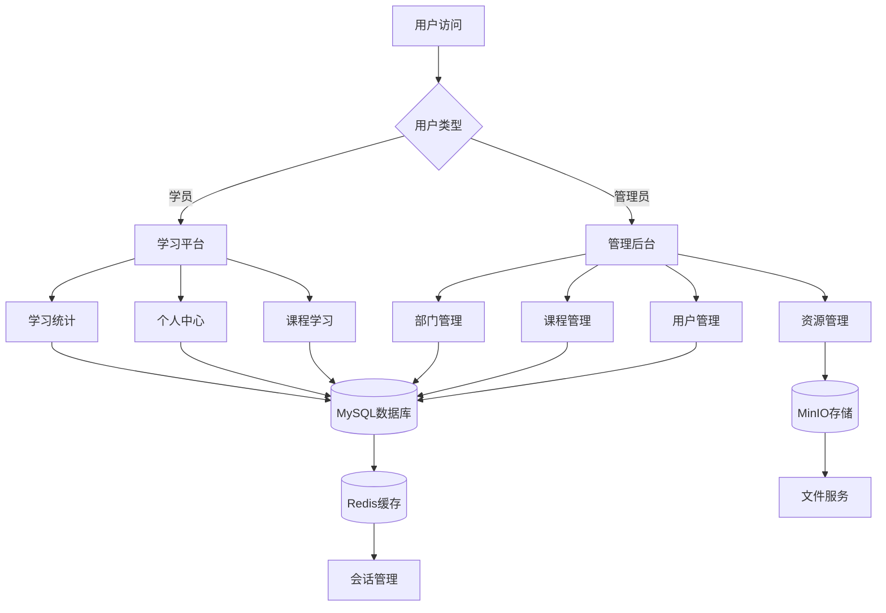

## 2. 用户认证流程图

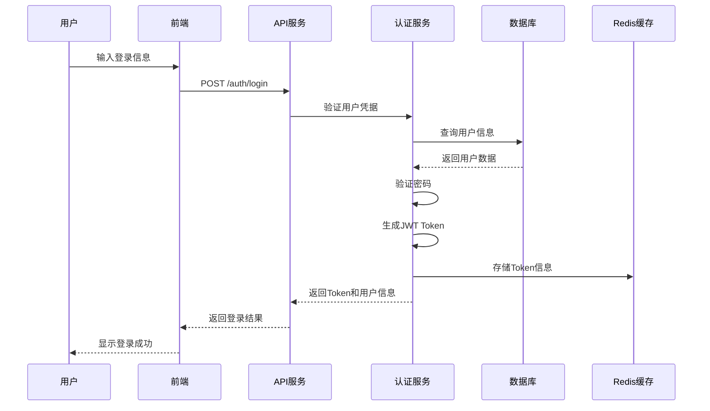

## 3. 课程学习流程图

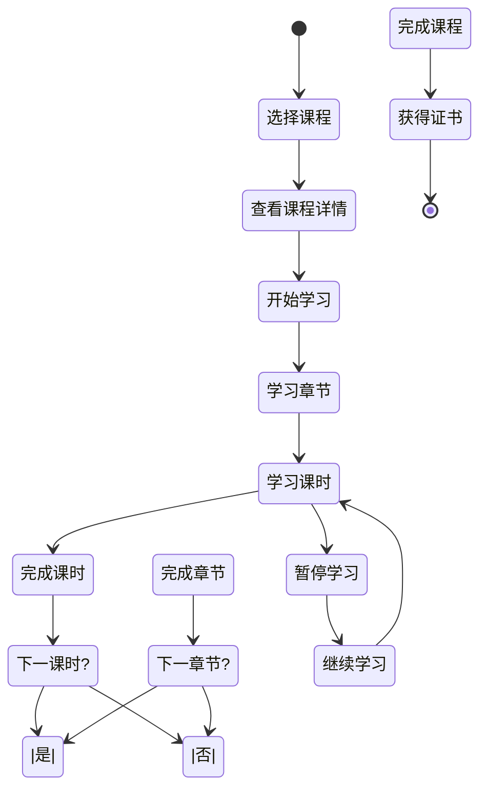

## 4. 课程管理流程图

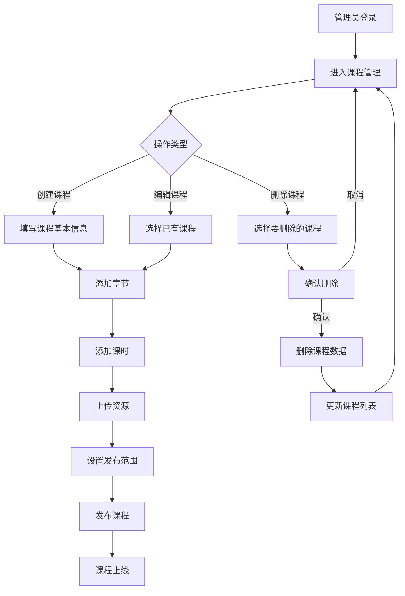

## 5. 资源上传流程图

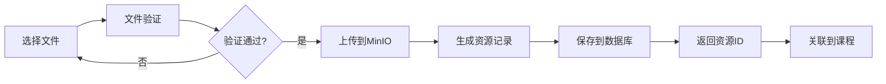

## 6. 用户注册流程图

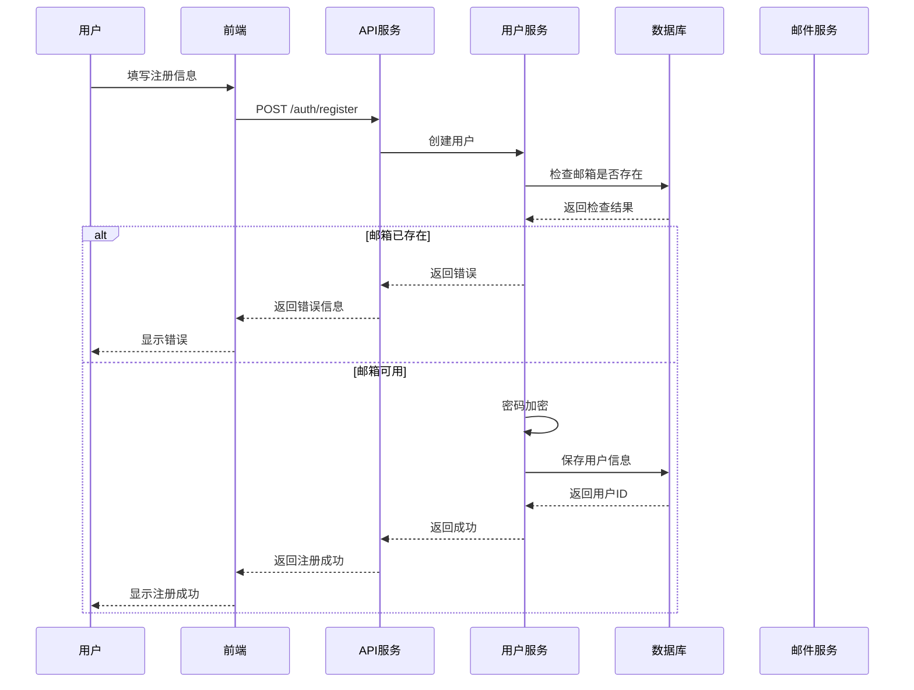

## 7. 权限控制流程图

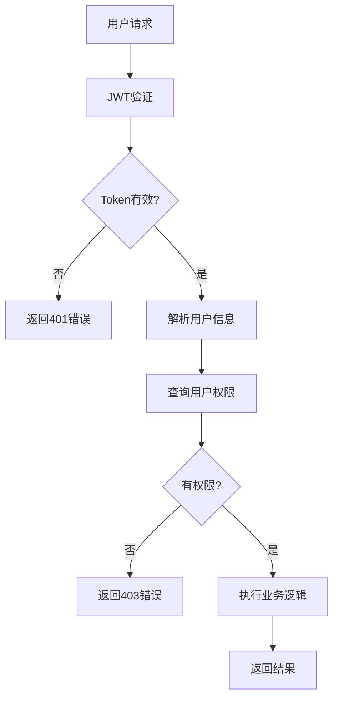

## 8. 数据同步流程图

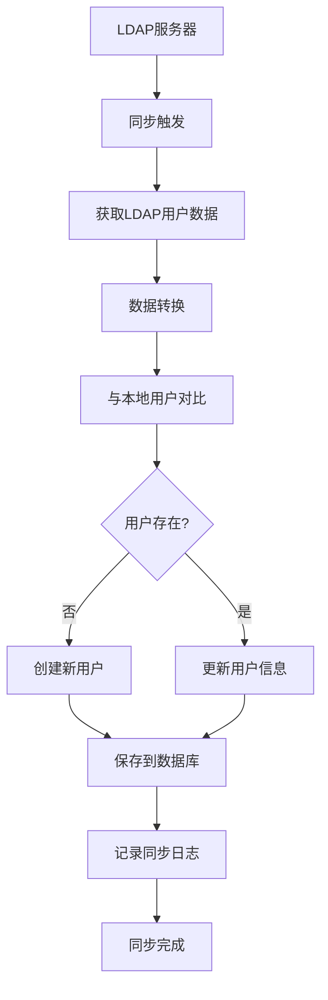

## 9. 学习进度跟踪流程图

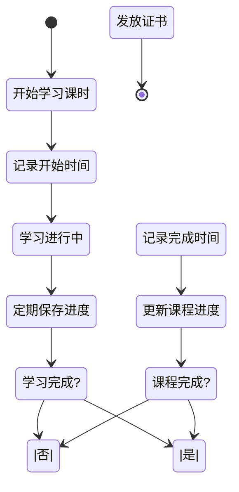

## 10. 系统监控流程图

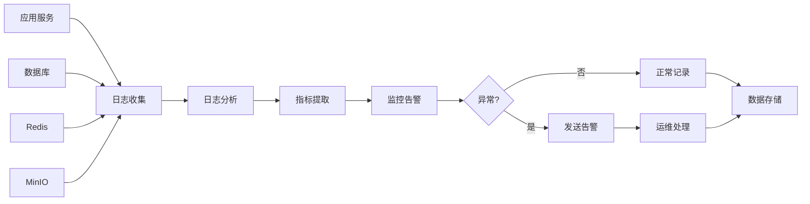

## 11. 部署流程图

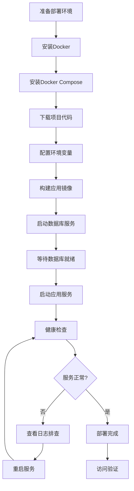

## 12. 备份恢复流程图

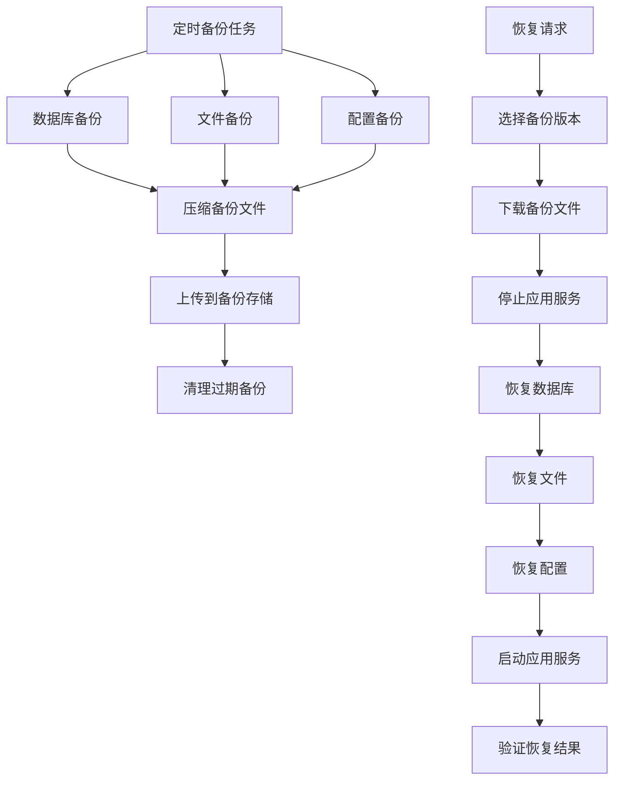

## 13. API请求处理流程图

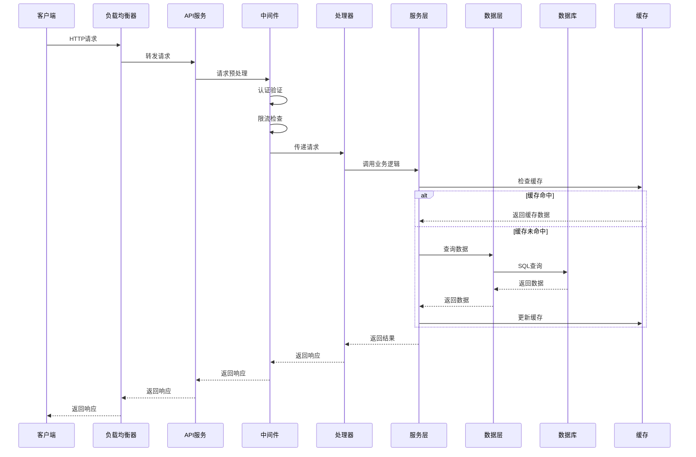

## 14. 文件处理流程图

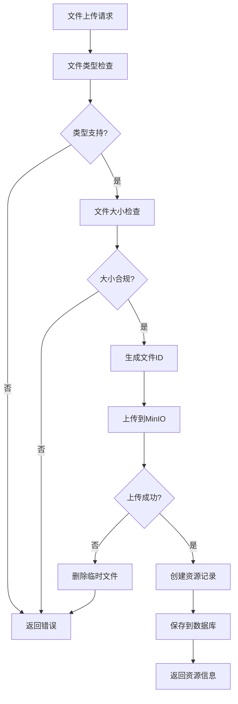

## 15. 课程发布流程图

```mermaid
stateDiagram-v2
    [*] --> 创建课程
    创建课程 --> 编辑基本信息
    编辑基本信息 --> 添加章节
    添加章节 --> 添加课时
    添加课时 --> 上传资源
    上传资源 --> 预览课程
    预览课程 --> {内容完整?}
    {内容完整?} -->|否| 添加课时
    {内容完整?} -->|是| 设置发布范围
    设置发布范围 --> 确认发布
    确认发布 --> 课程上线
    课程上线 --> 通知学员
    通知学员 --> [*]
```

---

*本文档包含EduFlow系统的主要业务流程和技术流程设计图*  
*版本: v1.0*  
*更新时间: 2024年*